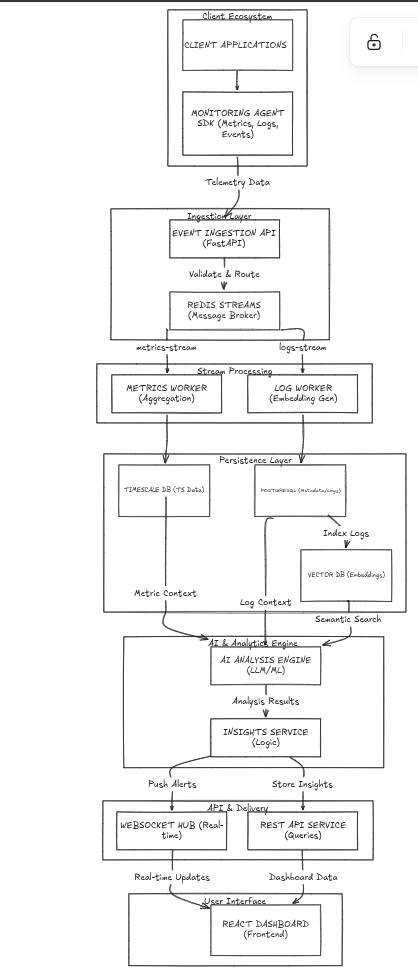

# Keo

Keo is an observability platform for instrumenting services, collecting telemetry, and turning raw signals into actionable insights. It includes a web dashboard, a realtime socket layer, background workers, a PostgreSQL + Redis persistence stack, and a companion SDK for integrating applications.

## What Keo Does

Keo helps you:

- collect metrics, logs, and deployment events from services
- stream live updates into a dashboard with WebSockets
- aggregate time-series data for service health views
- surface AI-assisted insights from metric and log context
- manage services, auth, and API keys from a single UI

## Key Features

- Realtime dashboard with live metrics and log streaming
- Service registry with per-service API keys
- SDK for Node.js applications with metrics, logs, and deployment tracking
- Redis Streams based ingestion pipeline
- Background workers for metrics, logs, deployments, and anomaly analysis
- AI-generated insights for suspicious patterns and context-rich alerts
- Authenticated dashboard APIs for service and telemetry management
- Service detail views for logs, deployments, metrics, and insights

## Architecture

The diagram below follows the architecture in your reference image and maps it to the current codebase.



## Stack And Technologies

### Frontend

- Next.js 16 with the App Router
- TypeScript
- Tailwind CSS 4
- Recharts for charts
- Lucide React for icons

### Backend And Data

- Node.js runtime
- PostgreSQL with Prisma ORM
- Redis for message brokering and live pipeline coordination
- Socket.IO for realtime updates
- JWT-based authentication
- Background worker processes for metrics, logs, deployments, and anomaly detection

### SDK

- TypeScript SDK published from the `sdk/` package
- ES module output plus CommonJS-compatible exports
- API helpers for metrics, logs, deployments, and middleware instrumentation

### AI And Analysis

- Google Generative AI integration for log and anomaly analysis
- Structured insight storage for downstream dashboard display

## How To Use Keo

Keo is meant to be consumed from your own application. The usual flow is:

1. Create a Keo account and register a service in the dashboard.
2. Copy the service API key and service ID for that service.
3. Install the SDK in your application.
4. Initialize the SDK in your app entry point.
5. Send metrics, logs, and deployment events from your code.
6. View live charts, logs, and AI insights in the Keo dashboard.

Example SDK setup:

```bash
pnpm add @keo-platform/monitor-sdk
```

```ts
import { Monitor } from "@keo-platform/monitor-sdk";

const monitor = new Monitor({
  apiKey: "YOUR_SERVICE_API_KEY",
  serviceId: "YOUR_SERVICE_ID",
});

monitor.start();
```

The SDK automatically handles metrics collection, batched logs, and deployment tracking from your app.

## Code Format And Module Style

Use TypeScript with ES modules and ES6-style `import` / `export` syntax throughout the project. The app is configured with `module: "esnext"` and `target: "ES2017"`, so modern ESM syntax is the preferred format.

Recommended conventions:

- use `import` and `export` instead of CommonJS `require`
- prefer async/await for async flows
- keep shared app code in `src/`
- keep SDK source code in `sdk/src/`

## SDK Package

From the `sdk/` directory:

- `pnpm build` - build the SDK package
- `pnpm dev` - watch TypeScript changes
- `pnpm lint` - lint SDK source files

## Planned And Possible Future Features

- alert routing to email, Slack, or Discord
- saved alert rules and custom thresholds per service
- distributed tracing and request waterfalls
- advanced filtering and search across logs and insights
- role-based access control for teams and organizations
- anomaly trend history with incident timelines
- SDK support for more runtimes and frameworks
- exportable reports and shareable read-only dashboards

## Repository Structure

- `src/app` - dashboard pages, API routes, and application layout
- `src/components` - reusable UI and dashboard widgets
- `src/lib` - auth, config, streams, workers, and server modules
- `sdk/` - standalone monitoring SDK package
- `prisma/` - Prisma schema and migrations

## Notes

- Keo is designed to instrument your application, not replace it.
- Use the SDK from your own Node.js service or API.
- The dashboard reflects telemetry that your application sends to Keo.
- AI insight generation is part of the Keo platform experience.


