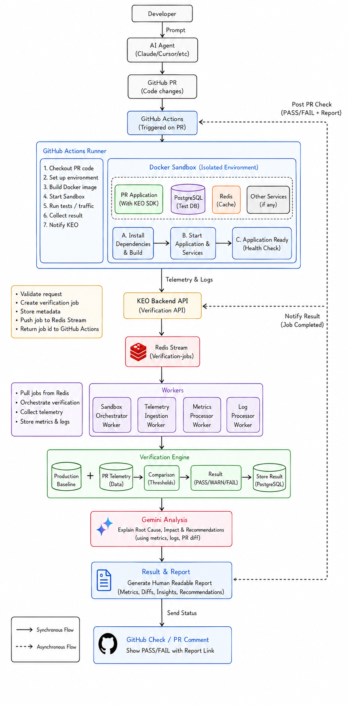
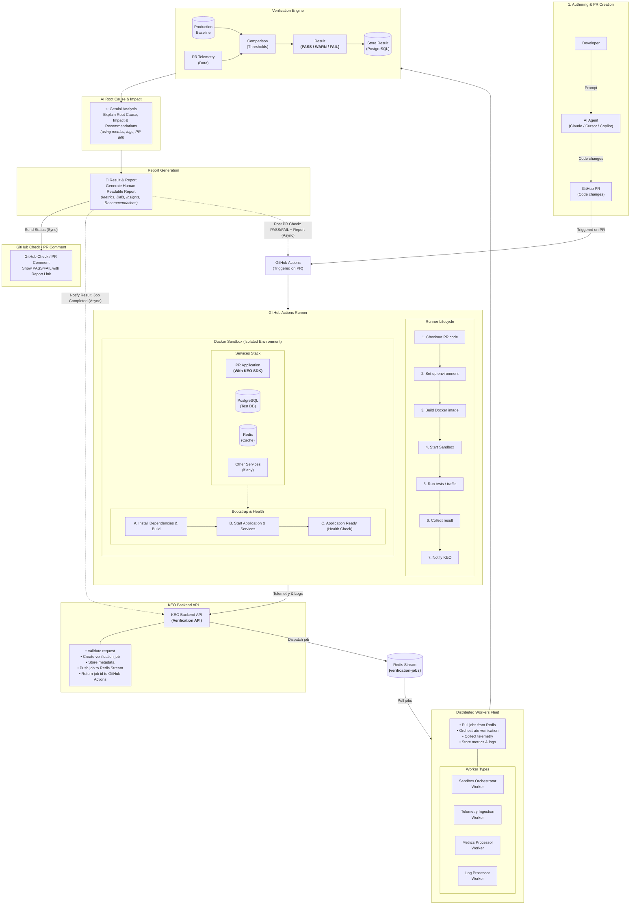

# Keo

> Production memory for coding agents. Route-level fingerprints, `would_this_regress` in Cursor, optional GitHub last mile.

Keo learns how a service actually behaves in production (p95 and errors per endpoint). Agents compare a change against that contract before they ship. GitHub Actions can post the same verdict; it is not the product.

---

## Architecture Overview

The following diagram illustrates Keo's end-to-end verification lifecycle: from code authoring with AI coding agents to sandboxed execution, telemetry ingestion, threshold evaluation, and GitHub reporting.




```mermaid
flowchart TD
    %% 1. Developer and AI Agent
    subgraph DevPhase ["1. Authoring & PR Creation"]
        Dev["Developer"] -->|"Prompt"| Agent["AI Agent<br/>(Claude / Cursor / Copilot)"]
        Agent -->|"Code changes"| PR["GitHub PR<br/>(Code changes)"]
    end

    PR -->|"Triggered on PR"| GHActions["GitHub Actions<br/>(Triggered on PR)"]

    %% 2. GitHub Actions Runner
    subgraph Runner ["GitHub Actions Runner"]
        direction TB
        subgraph Steps ["Runner Lifecycle"]
            direction TB
            S1["1. Checkout PR code"]
            S2["2. Set up environment"]
            S3["3. Build Docker image"]
            S4["4. Start Sandbox"]
            S5["5. Run tests / traffic"]
            S6["6. Collect result"]
            S7["7. Notify KEO"]
            S1 --> S2 --> S3 --> S4 --> S5 --> S6 --> S7
        end

        subgraph Sandbox ["Docker Sandbox (Isolated Environment)"]
            direction TB
            subgraph Services ["Services Stack"]
                direction LR
                PRApp["PR Application<br/><b>(With KEO SDK)</b>"]
                TestDB[("PostgreSQL<br/>(Test DB)")]
                Cache[("Redis<br/>(Cache)")]
                Other["Other Services<br/>(if any)"]
            end
            subgraph SandboxLifecycle ["Bootstrap & Health"]
                direction LR
                StepA["A. Install Dependencies & Build"] --> StepB["B. Start Application & Services"] --> StepC["C. Application Ready (Health Check)"]
            end
            Services -.-> SandboxLifecycle
        end
    end

    GHActions --> Runner
    Runner -->|"Telemetry & Logs"| BackendAPI

    %% 3. KEO Backend API
    subgraph BackendBox ["KEO Backend API"]
        direction TB
        BackendAPI["KEO Backend API<br/><b>(Verification API)</b>"]
        APIDetails["• Validate request<br/>• Create verification job<br/>• Store metadata<br/>• Push job to Redis Stream<br/>• Return job id to GitHub Actions"]
        BackendAPI --- APIDetails
    end

    BackendAPI -->|"Dispatch job"| RedisStream[("Redis Stream<br/><b>(verification-jobs)</b>")]

    %% 4. Workers Fleet
    subgraph WorkersBox ["Distributed Workers Fleet"]
        direction TB
        WorkerDetails["• Pull jobs from Redis<br/>• Orchestrate verification<br/>• Collect telemetry<br/>• Store metrics & logs"]
        subgraph WorkerGrid ["Worker Types"]
            direction LR
            W1["Sandbox Orchestrator<br/>Worker"]
            W2["Telemetry Ingestion<br/>Worker"]
            W3["Metrics Processor<br/>Worker"]
            W4["Log Processor<br/>Worker"]
        end
        WorkerDetails --- WorkerGrid
    end

    RedisStream -->|"Pull jobs"| WorkersBox

    %% 5. Verification Engine
    subgraph Engine ["Verification Engine"]
        direction LR
        Baseline[("Production<br/>Baseline")]
        PRData["PR Telemetry<br/>(Data)"]
        Baseline --> Comp["Comparison<br/>(Thresholds)"]
        PRData --> Comp
        Comp --> Verdict["Result<br/><b>(PASS / WARN / FAIL)</b>"]
        Verdict --> StoreDB[("Store Result<br/>(PostgreSQL)")]
    end

    WorkersBox --> Engine

    %% 6. Gemini Analysis
    subgraph AI ["AI Root Cause & Impact"]
        Gemini["✨ Gemini Analysis<br/>Explain Root Cause, Impact & Recommendations<br/><i>(using metrics, logs, PR diff)</i>"]
    end

    Engine --> Gemini

    %% 7. Result & Report
    subgraph Reporting ["Report Generation"]
        ReportGen["📄 Result & Report<br/>Generate Human Readable Report<br/><i>(Metrics, Diffs, Insights, Recommendations)</i>"]
    end

    AI --> ReportGen

    %% 8. Feedback & Checks
    subgraph GitHubOutput ["GitHub Check / PR Comment"]
        GHComment["GitHub Check / PR Comment<br/>Show PASS/FAIL with Report Link"]
    end

    %% Solid = Synchronous Flow
    ReportGen -->|"Send Status (Sync)"| GHComment

    %% Dashed = Asynchronous Flow
    ReportGen -.->|"Notify Result: Job Completed (Async)"| BackendAPI
    ReportGen -.->|"Post PR Check: PASS/FAIL + Report (Async)"| GHActions
```

### Flow Legend

| Flow Type | Representation | Description |
| :--- | :---: | :--- |
| **Synchronous Flow** | `—>` (Solid line) | Direct execution flow (e.g. prompt to PR, runner step sequence, status updates). |
| **Asynchronous Flow** | `- - >` (Dashed line) | Event-driven notifications (e.g. worker job completion callback, background check posting). |

---

## End-to-End System Workflow

### 1. Developer & AI Coding Agent
1. The **Developer** provides a prompt or feature request to an **AI Agent** (e.g., Claude Code, Cursor, GitHub Copilot).
2. The agent implements changes and creates a **GitHub Pull Request**.

### 2. GitHub Actions Runner & Isolated Docker Sandbox
When the PR is opened or updated, **GitHub Actions** triggers the verification workflow on an Actions runner:
- **Runner Execution Steps**:
  1. `Checkout PR code` — clones repository branch.
  2. `Set up environment` — prepares Docker and configuration tokens.
  3. `Build Docker image` — builds the PR image target (`keo-pr:$KEO_SHA`).
  4. `Start Sandbox` — launches `docker-compose.pr-sandbox.yml`.
  5. `Run tests / traffic` — executes realistic traffic scripts (or test suites) against the sandboxed app.
  6. `Collect result` — captures container health status and logs.
  7. `Notify KEO` — signals completion and closes the telemetry window.
- **Docker Sandbox (Isolated Environment)**:
  - **Services**: Spins up the **PR Application** instrumented with the **KEO SDK**, alongside isolated **PostgreSQL (Test DB)**, **Redis (Cache)**, and supporting mock services.
  - **Readiness Lifecycle**:
    1. **A. Install Dependencies & Build**
    2. **B. Start Application & Services** (including database migrations)
    3. **C. Application Ready (Health Check)** via `/api/health`
- **Telemetry & Logs**: The KEO SDK inside the sandbox streams tagged metrics and runtime logs directly to the KEO Backend API.

### 3. KEO Backend API (Verification API)
The Verification API acts as the gateway for the scoring pipeline:
- **Validates** incoming requests and tokens (`x-keo-verification-token`).
- **Creates** a verification job record with repository, commit SHA, PR number, and service IDs.
- **Stores** job metadata and execution state in PostgreSQL.
- **Pushes** the verification task onto Redis Streams (`verification-jobs`).
- **Returns** the unique `jobId` to GitHub Actions to tag subsequent runner operations (`KEO_VERIFICATION_JOB_ID`).

### 4. Redis Stream & Distributed Worker Fleet
Verification tasks are queued in the `verification-jobs` Redis Stream and consumed by background workers:
- **Workers responsibilities**:
  - Pull jobs from Redis consumer groups (`verification-workers`).
  - Orchestrate sandbox verification lifecycle.
  - Ingest live telemetry streams from the sandbox.
  - Store and index time-series metrics and logs.
- **Specialized Workers**:
  - **Sandbox Orchestrator Worker** — coordinates sandbox execution and job timeouts.
  - **Telemetry Ingestion Worker** — receives real-time telemetry from the KEO SDK.
  - **Metrics Processor Worker** — computes averages, percentiles, and resource utilization.
  - **Log Processor Worker** — parses, filters, and correlates application logs with error spikes.

### 5. Deterministic Verification Engine
The Verification Engine performs objective, reproducible score evaluation:
- Loads the **Production Baseline** (the latest snapshot or historical sample of CPU, memory, latency, and error rate).
- Loads the **PR Telemetry Data** collected during the test execution window.
- **Comparison (Thresholds)**: Evaluates observed deltas against regression limits:
  - Default limits: **CPU (+20%)**, **Memory (+20%)**, **Latency (+15%)**, **Errors (+10%)**.
  - A regression exceeding 75% of the threshold produces a `WARN`.
  - A regression exceeding the threshold produces a `FAIL`.
- **Result**: Assigns a deterministic verdict (`PASS`, `WARN`, `FAIL`).
- **Store Result**: Saves the full comparison matrix, delta percentages, and verdict into **PostgreSQL**.

### 6. Gemini AI Analysis (Root Cause & Recommendations)
Once the deterministic verdict is set, Google Gemini evaluates the findings:
- Analyzes metrics deltas, correlated error logs, and the git PR diff.
- Explains the **Root Cause** of observed regressions.
- Outlines the potential **Production Impact**.
- Suggests concrete, actionable **Recommendations** for resolving issues.

> [!IMPORTANT]
> **Deterministic Verdict Guarantee**: Gemini explains the evidence and provides contextual recommendations; it never decides the `PASS` / `WARN` / `FAIL` verdict. The verdict is always decided deterministically by threshold comparison.

### 7. Result & Report Generation
Generates a comprehensive, human-readable report combining:
- Visual comparison tables (Baseline vs. Observed vs. Thresholds).
- Metric delta breakdowns.
- Log error snippets.
- AI-generated root cause analysis and recommendations.

### 8. GitHub Feedback & Asynchronous Notifications
- **Synchronous Flow**:
  - Posts a rich summary comment on the GitHub Pull Request with the verdict table and dashboard link.
  - Updates the **GitHub Merge Check** (`KEO merge verification`): `PASS` sets check success, `WARN` sets neutral, and `FAIL` blocks merging when required in branch protection.
- **Asynchronous Flow**:
  - **Notify Result (Job Completed)**: Signals the KEO Backend API that processing is complete.
  - **Post PR Check (PASS/FAIL + Report)**: Notifies the GitHub Actions runner waiting for verification completion.

---

## Tech Stack

### Frontend & Dashboard
- **Framework**: Next.js 16 (App Router)
- **Language**: TypeScript
- **Styling**: Tailwind CSS 4
- **Visualizations**: Recharts
- **Icons**: Lucide React
- **Real-Time Updates**: Socket.IO client

### Backend & Infrastructure
- **Runtime**: Node.js
- **Database & ORM**: PostgreSQL with Prisma ORM
- **Queue & Streaming**: Redis (Redis Streams, pub/sub, caching)
- **Real-Time Sockets**: Socket.IO server for live job telemetry
- **Containerization**: Docker & Docker Compose for isolated PR sandboxes

### KEO Monitor SDK
- **Package**: `@keo-platform/monitor-sdk` (TypeScript / ESM + CJS)
- **Location**: `sdk/`
- **Capabilities**: Automatic request instrumentation, CPU/memory metric collection, error log streaming, and verification job tagging via `KEO_VERIFICATION_JOB_ID`.

### AI & Diagnostics
- **Engine**: Google Generative AI (Gemini 2.5 Flash / Gemini Pro)
- **Outputs**: Structured root-cause hypotheses, performance impact assessments, and remediation advice.

---

## Getting Started

### 1. Production fingerprint
1. Sign up, create an application, generate an SDK API key.
2. In **production**, install `@keo-platform/monitor-sdk`, call `monitor.start()` and `monitor.middleware()`. Point `baseUrl` / `KEO_BASE_URL` / `KEO_API_URL` at the **Keo server**.
3. Run Keo workers (`npm run dev:workers`). After traffic, **Fingerprint** (`/`) shows a 14-day contract (process averages + per-route p95 / error rate). Sandbox metrics with `KEO_VERIFICATION_JOB_ID` are excluded.

### 2. GitHub checks (on the customer's repo)
Keo does not score PRs to the Keo repository. Developers copy [`examples/app-repo`](./examples/app-repo) into **their** product repo and set secrets pointing at **your** deployed Keo (`KEO_API_URL`). Their PRs get the `KEO merge verification` check. You see the same jobs in the Keo dashboard.

See [examples/app-repo/README.md](./examples/app-repo/README.md) and [docs/pr-verification.md](./docs/pr-verification.md).

### 3. Cursor (same engine)
`npm --prefix mcp install`. Copy `.cursor/mcp.json.example`. `get_fingerprint` and `would_this_regress` (`jobId` or local observed routes).

---

## Verdict & Threshold Decision Matrix

| Verdict | Condition | GitHub Check Conclusion | Merge Status |
| :--- | :--- | :--- | :--- |
| **`PASSED`** | All metrics within normal baseline tolerance ($\le 75\%$ of threshold limit) | `success` | Merge allowed |
| **`WARNING`** | Any metric exceeds $75\%$ of threshold limit without exceeding $100\%$ | `neutral` | Informational |
| **`FAILED`** | Any metric exceeds $100\%$ of threshold limit (e.g. latency $> +15\%$, CPU $> +20\%$) | `failure` | Blocks PR merge |
| **`ERROR`** | Insufficient telemetry, sandbox crash, or verification timeout | `failure` | Blocks PR merge |

---

## Repository Structure

```text
├── .github/workflows/         # CI/CD and PR verification workflows
│   └── pr-verification.yml    # GitHub Actions workflow running sandbox & scoring
├── docker-compose.pr-sandbox.yml  # Sandbox environment definition (App + DB + Redis)
├── docker-compose.verification.yml# Standalone verification compose environment
├── docs/                      # Extended guides and setup documentation
│   └── pr-verification.md     # In-depth PR verification guide
├── img.png                    # System architecture diagram
├── prisma/                    # Prisma database schema and migrations
├── sdk/                       # @keo-platform/monitor-sdk source and package build
│   └── src/                   # SDK core, metric exporters, and log collectors
├── src/
│   ├── app/                   # Next.js App Router (dashboard UI & API routes)
│   ├── components/            # Reusable UI components and comparison charts
│   └── lib/                   # Core business logic
│       ├── config/            # Prisma, Redis, and environment configs
│       ├── modules/           # Verification analyzer & baseline services
│       ├── streams/           # Redis Stream producers and consumers
│       └── workers/           # Background worker fleet (metrics, logs, verification)
```

---

## SDK Development

From the `sdk/` directory:

```bash
cd sdk
pnpm install
pnpm build   # Build ESM and CJS bundles
pnpm dev     # Watch mode for development
pnpm lint    # Lint SDK source code
```

---

## Core Principles

1. **Deterministic by Design**: Verdicts are computed using math and thresholds—never hallucinated.
2. **AI with Accountability**: Gemini explains why regressions occurred and how to fix them, but cannot alter the pass/fail result.
3. **Hermetic Sandboxing**: Every PR runs in its own isolated stack (app, PostgreSQL, Redis) with its own telemetry window.
4. **Zero Flakiness from Multi-PR Concurrency**: Every metric event carries the unique `verificationJobId`, ensuring clean isolation even under concurrent runs.
